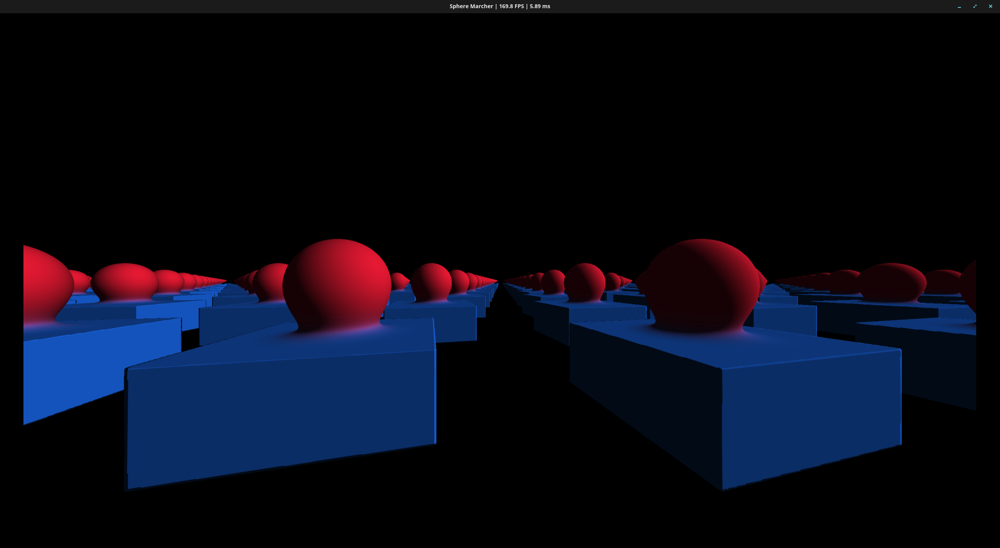

# RAY MARCHING - MATH 578 FINAL PROJECT
---

In this repository, I am experimenting with ray marching for my final project. Here I will try to go over some of the math, a lot of which will just be a regurgitation of what Inigo Quilez already has on his [website](https://iquilezles.org/articles/). All rendering code is in CUDA C/C++ (I prefer sticking to C when I can), and the graphical window is created using SDL. Typically one might use OpenGL/Vulkan and GLSL or DirectX and HLSL, but since this project is academic and not for real use, I will stick with what I am familiar with for now.

### What is an SDF?
An SDF is a signed distance function. The goal of an SDF is, given a point in space, to return the distance from that point to the boundary of an object. Here is the SDF of a sphere for example:

```cpp
float sdSphere(float3 point, float radius) {
    return length(point) - radius;
}
```

Given a point, we compute its distance to `(0, 0, 0)` using the `length` function (the dot product with itself), and compare it to the radius. Thus we end up with a value that is negative if inside the sphere, positive if outside the sphere, and 0 exactly on the boundary of the sphere. We can query this function at any point in space, and draw to the screen when we approach 0.

Here is the SDF for a box:

```cpp
__device__ float sdBox(float3 point, float3 b) {
    float3 d = abs(point) - b;
    return length(max(d, 0.0f)) + fminf(fmaxf(d.x, fmaxf(d.y, d.z)), 0.0f);
}
```


One interesting thing is that we can draw to screen anything that has these rules. There are so many different unique SDFs and Inigo Quilez does a great job showcasing a lot of them in his painting with math series.

### Smoothmin


### Raymarching

Raymarching is the technique that allows us to use these SDFs to draw to the screen. At a high level, from a point we shoot out rays corresponding to each pixel of our graphical window. These rays step along until they either shoot off into empty space, or they approach an object. We can tell whether or not we are approaching an object by repeatedly querying the SDF. If the distance returned by the SDF goes below some specified epsilon, we can take it that the ray has hit the object, and draw the corresponding colour to the screen.
But how do we know how much the ray can step at any given moment without accidentally running into or past an object? The most common and easiest to implement technique for raymarching is called *sphere tracing*. When we query the distance function, we know that it is returning the minimal distance to any object. Thus by stepping that amount, we can be sure we have not run into or passed anything. The reason this is referred to as sphere tracing is because we know when querying the distance that there is no object within d units of distance in any direction, forming a sort of sphere of radius d where nothing exists.

### Repeated Domain


### Shadows / Soft Shadows


### Screenshots

Here I will post screenshot(s) of what it looks like currently, since this project uses cuda and is thus not easily usable by any device without an nvidia gpu.

